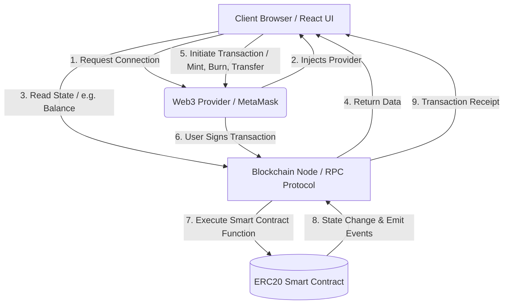

# ONE DEV (OD) - ERC20 Token DApp


A complete Full-Stack Web3 application demonstrating the deployment and interaction with a custom ERC20 Smart Contract on the Ethereum blockchain. Built with React (Vite), Ethers.js v6, Hardhat, and Solidity.

---

## 📑 Table of Contents

- [Architecture & Industry-Level Flow](#-architecture--industry-level-flow)
- [Key Features](#-key-features)
- [Tech Stack](#-tech-stack)
- [Prerequisites](#-prerequisites)
- [Local Installation & Setup](#-local-installation--setup)
- [Smart Contract Deployment](#-smart-contract-deployment)
- [Frontend Development](#-frontend-development)
- [Environment Variables](#-environment-variables)
- [License](#-license)

---

## 🏗 Architecture & Industry-Level Flow

The application follows a standard Web3 industry-level architecture, ensuring secure, decoupled, and efficient interactions between the client UI and the blockchain network.



### 🔹 DApp Interaction Lifecycle

1. **Wallet Connection**: The user accesses the frontend and connects their browser-based wallet (e.g., MetaMask).
2. **State Synchronization**: The React application instantiates an Ethers.js `BrowserProvider` to query the smart contract on the blockchain and display real-time data such as token balance, `totalSupply`, etc.
3. **Transaction Initiation**: The user triggers a writable action (e.g., minting new tokens or transferring `OD` tokens to another address).
4. **Transaction Signing**: The frontend prompts the connected wallet to securely sign the transaction payload locally. Private keys are never exposed.
5. **On-Chain Execution**: The signed transaction is broadcasted to the network (Sepolia/Mainnet/Localhost). The `ERC20.sol` contract processes the logic (checking permissions, balances, and adjusting balances).
6. **Confirmation & UI Update**: Upon block inclusion, the frontend awaits the transaction receipt and synchronously updates the local React state to reflect the new blockchain state.

---

## ✨ Key Features

- **Custom ERC20 Token**: Implements standard Ethereum token features with extended administrative functionalities.
- **Role-Based Minting**: Only the deployer (`owner`) can mint new tokens, preventing arbitrary inflation.
- **Burn Mechanics**: Any token holder can permanently destroy their tokens computationally, reducing `totalSupply`.
- **Peer-to-Peer Transfer**: Standard decentralized transfer of values between accounts.
- **Modern React Frontend**: Fast and optimized UI driven by Vite, styled for an intuitive user experience.

---

## 🛠 Tech Stack

### Smart Contracts (Backend)
- **Solidity (^0.8.0)**: Object-oriented programming language for writing smart contracts.
- **Hardhat**: Ethereum development environment for compiling, deploying, testing, and debugging software.
- **Ethers.js v6**: Library for interacting with the Ethereum Blockchain and its ecosystem.
- **Hardhat Ignition**: A declarative deployment system for Hardhat.

### Frontend (Client)
- **React 19**: Modern UI library using component-based architecture.
- **Typescript**: Strongly typed programming language that builds on JavaScript.
- **Vite**: Next-generation frontend tooling for blistering fast HMR and compilation.

---

## ⚙️ Prerequisites

Before getting started, ensure you have the following installed on your local machine:
- [Node.js](https://nodejs.org/en/) (v18.0.0 or higher recommended)
- `npm` or `yarn` package manager
- [MetaMask](https://metamask.io/) browser extension wallet

---

## 🚀 Local Installation & Setup

1. **Clone the Repository** (or navigate to your local working directory):
   ```bash
   git clone <repository_url>
   cd testnet_development
   ```

2. **Install Dependencies**:
   This project operates as a monorepo setup. The root `package.json` manages dependencies for both Hardhat and the Vite frontend.
   ```bash
   npm install
   ```

3. **Set Up Environment Variables**:
   Update your root `.env` file to include necessary secrets for testing on testnets.
   ```env
   SEPOLIA_RPC_URL="https://eth-sepolia.g.alchemy.com/v2/YOUR_API_KEY"
   PRIVATE_KEY="YOUR_WALLET_PRIVATE_KEY"
   ```

---

## ⛓ Smart Contract Deployment

### Running a Local EVM Node
To test the smart contracts securely on your local machine without incurring gas fees:
```bash
npx hardhat node
```
*This spins up a local simulated blockchain and provides 20 pre-funded test accounts.*

### Deploying the Contract
Once your node is running (in a separate terminal) or your `.env` is configured for a specific network:
```bash
# Deploy to local network
npx hardhat ignition deploy ./ignition/modules/Lock.ts --network localhost

# Deploy to Sepolia Testnet
npx hardhat ignition deploy ./ignition/modules/Lock.ts --network sepolia
```

### Running Tests
To execute the automated contract integration tests:
```bash
npx hardhat test
```

---

## 🖥 Frontend Development

To spin up the React development server utilizing Vite:

```bash
npm run dev
```
The application will be accessible at `http://localhost:5173`. Make sure to switch your MetaMask network to the one where your contract is deployed (e.g., Localhost 8545 or Sepolia Testnet).

---

## 📝 License

Distributed under the **MIT License**. See `LICENSE` for more information.
